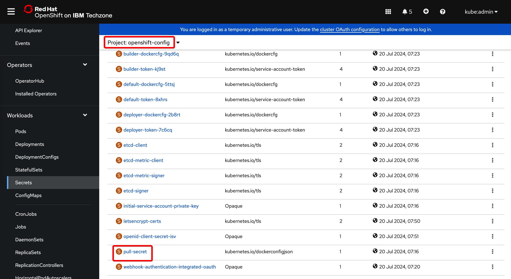

# Cloud Pak for Integration installation using ArgoCD


## 1. Setup ArgoCD

### 1.1. Install OpenShift GitOps operator

In the OpenShift web console, navigate to **Operators > OperatorHub** and find *Red Hat OpenShift GitOps* - install it with default settings.


⚠️ NOTE: The namespace to install the operator is **openshift-gitops-operator**. When the operator is installed, the operands are automatically created in the **openshift-gitops** namespace.


### 1.2. Add cluster role to ArgoCD application controller service account

This step is necessary so that ArgoCD can manage objects in other namespaces. However, be aware that assigning the cluster administrator role to the application controller service account gives ArgoCD full administrative rights over the entire cluster. This is OK for demo environments, but probably not for production. Consider using the appropriate Kubernetes role bindings for the selected namespaces in the case of a production configuration.

For simplicity's sake, we will just add the cluster-admin role in our case:
```
oc adm policy add-cluster-role-to-user cluster-admin -z openshift-gitops-argocd-application-controller -n openshift-gitops
```

### 1.3. Access ArgoCD

Run the following commands to retrieve the ArgoCD console admin password:
```
argoPass=$(oc get secret/openshift-gitops-cluster -n openshift-gitops -o jsonpath='{.data.admin\.password}' | base64 -d)
echo $argoPass
```

You can open ArgoCD web console from the OpenShift's web console toolbar:


Login with user name **admin** and previously retrieved password:


### 1.4. Configure Git repository connection

This step is only required for private Git repositories, you can skip it if you are using public GitHub. There are several options to access the repository like using access tokens, ssh, etc...
The easiest is with an access-token.

In your GitHub repository, click the user icon and navigate to **Settings > Developer settings > Personal access tokens** and create token. 


Switch to ArgoCD console and select **Settings > Repositories**


Click on **CONNECT REPO**


For method, select: **VIA HTTPS** <br>
For type, select: **git** <br>
For project, select: **default** <br>
Enter your **repository URL**. <br>
For username, enter your **GitHub user name**. <br>
For password, enter previously generated **token** <br>
Confirm by clicking on button **CONNECT**


## 2. Setup Tekton

### 2.1. Install OpenShift Pipelines operator

In the OpenShift web console, click OperatorHub and and enter *openshift pipelines* as a search string. Install **Red Hat OpenShift Pipelines** using default settings.


### 2.2. Create project and add cluster role to the service account

Create a project/namespace that will be used to store the tekton artifacts. In this case we decided to call it **cp4i-pipelines**

>NOTE: Any name can be used for the project, but if you choose to use something other than *cp4i-pipelines*, you must also fix the Tekton artifacts available in the folder [cp4i-manifests/tekton](cp4i-manifests/tekton)  

In order that Tekton pipelines can perform changes in other namespaces, we will give the cluster admin role to the **pipeline** service account. This is probably not best practice in production, but it's fine for a demo. Run the following command:

```sh
oc adm policy add-cluster-role-to-user cluster-admin -z pipeline -n cp4i-pipelines
```

>ADDITIONAL NOTE: We will automate these steps in one of the next releases of the demo.

## 3. Update global pull secret

We have to add IBM entitlement key to the global pull secret. The alternative is to create *ibm-entitlement-key* secret in the target namespace, but in this case that would mean we have yaml with the secret in the repository.

Look for a secret named **pull-secret** in the **openshift-config** namespace.



Edit the secret. Enter **cp.icr.io** as the registry address, **cp** as the username, and your entitlement key as the password.


## 6. Start CP4I installation. 

## 6.1. Description of the GitOps setup

***Definitions:***

*a.)* All artifacts are organized into two main folders. The [cp4i-gitops](cp4i-gitops) folder contains subfolders with ArgoCD applications and Kustomization files. The second folder is [cp4i-matifests](cp4i-manifests). In contains YAML definitions of Kubernetes/OpenShift objects, custom resources and in some cases also Kustomization files. 

*b.)* In most cases, there is one ArgoCD application in the gitops folder that corresponds to one OpenShift object in the manifests folder. In some cases, an ArgoCD application corresponds to a group of OpenShift objects.

*c.)* There is one ArgoCD application named [cp4i-bootstrap](cp4i-bootstrap.yaml) which is not located in the gitops folder but in the root folder of this repository. It is the ignition app that launches all other apps.

*d.)* There is a hierarchical relationship between applications. A bootstrap application invokes a group of other applications that are responsible for different types of objects (e.g. namespaces, catalog sources, operators, etc.). These applications invoke the next level of applications that are responsible for individual objects.

*e.)* Whenever one application calls more than one other application, there is a Kustomization file in between. The calling application points to the folder with a Kustomization file, which in turn references the called applications. In that way we can use Kustomization to switch-on/switch-off branches in the hierarchy.

*f.)* The "sync waves" are defined for each ArgoCD application. They ensure the order of execution. For example, that the operators are installed before the capability instances are created. The subfolder names contain prefixes that represent the sync wave values ​​of the contained applications. For example folder *10-namespaces* contains applications with sync wave 10. 


***Example:***


